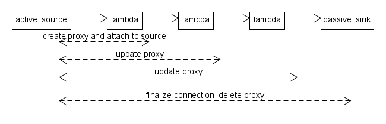

#ActiveConnectionProxy

Active connection proxies are temporary objects used in the creation of connections between ports.
They only appear when an __ActiveConnectable__ is connected.

Since active_connectables have ownership of their connections, they need to store them.
Active_connectables store the connections as `std::function` objects with signatures matching their own type.
An active source (event source) of type `int` expects no return and thus uses the signature `void(int)`.

When the active_connectable is connected to a connectable, this connection cannot be stored in the active_connectable yet.
Instead an active connection proxy is created which takes ownership of the connectable and holds a reference to the active connectable.
The connection is completed, when a passive_connectable is connected.
Until then, the intermediate connection of the connectables is built up and stored in the `active_connection_proxy`.
When the proxy reaches a passive_connectable, the connection stored within the proxy is connected to the passive_connectable and the resulting connection gets connected to the active_connectable. The proxy is then destroyed as the active_connectable takes over the full connection.

Creation and use of active connection proxies is completely symmetric for events and states. The only difference is that for events the source is active, and thus the proxy is built from left to right while for states the sink is active and the proxy thus built from right to left. 

Due to operator precedence rules in the typical chain of connections

    passive >> connectable_a >> connectable_b >> active;

an `active_connection_proxy` will _NOT_ be created, as simple `connection` objects are sufficient.

Active connection proxy objects may be stored in a variable, but cannot be used to connect more than once. Therefore it is necessary to `std::move` the variable storing the proxy when connecting the next connectable to it.
~~~{.cpp}
auto proxy = active >> connectable;
// proxy >> passive; // BAD! does not compile
std::move(proxy) >> passive; // GOOD, proxy may not be used again
~~~

